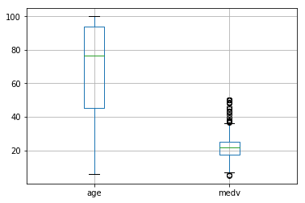
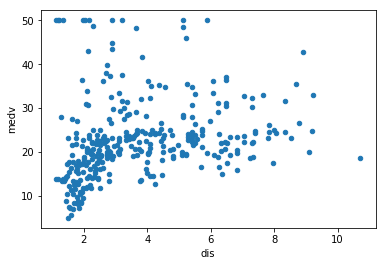
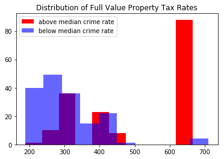
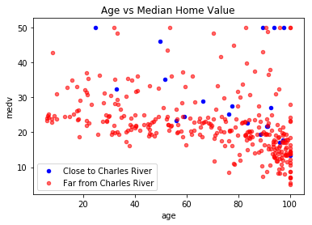

# Project - EDA with Pandas Using the Boston Housing Data

## Introduction

In this section you've learned a lot about importing, cleaning up, analyzing (using descriptive statistics) and visualizing data. In this more free form project you'll get a chance to practice all of these skills with the Boston Housing data set, which contains housing values in the suburbs of Boston. The Boston Housing Data is commonly used by aspiring data scientists.

## Objectives

You will be able to:

* Load csv files using Pandas
* Find variables with high correlation
* Create box plots

## Goals

Use your data munging and visualization skills to conduct an exploratory analysis of the dataset below. At a minimum, this should include:

* Loading the data (which is stored in the file `train.csv`)
* Use built-in python functions to explore measures of centrality and dispersion for at least 3 variables
* Create *meaningful* subsets of the data using selection operations like `.loc`, `.iloc` or related operations. Explain why you used the chosen subsets and do this for 3 possible 2-way splits. State how you think the 2 measures of centrality and/or dispersion might be different for each subset of the data. Examples of potential splits:
    - Create 2 new dataframes based on your existing data, where one contains all the properties next to the Charles river, and the other one contains properties that aren't.
    - Create 2 new dataframes based on a certain split for crime rate.
* Next, use histograms and scatter plots to see whether you observe differences for the subsets of the data. Make sure to use subplots so it is easy to compare the relationships.

## Variable Descriptions

This data frame contains the following columns:

#### crim  
per capita crime rate by town.

#### zn  
proportion of residential land zoned for lots over 25,000 sq.ft.

#### indus  
proportion of non-retail business acres per town.

#### chas  
Charles River dummy variable (= 1 if tract bounds river; 0 otherwise).

#### nox  
nitrogen oxide concentration (parts per 10 million).

#### rm  
average number of rooms per dwelling.

#### age  
proportion of owner-occupied units built prior to 1940.

#### dis  
weighted mean of distances to five Boston employment centers.

#### rad  
index of accessibility to radial highways.

#### tax  
full-value property-tax rate per $10,000.

#### ptratio  
pupil-teacher ratio by town.

#### black  
1000(Bk - 0.63)^2 where Bk is the proportion of blacks by town.

#### lstat  
lower status of the population (percent).

#### medv  
median value of owner-occupied homes in $10000s.
  
  
  
Source
Harrison, D. and Rubinfeld, D.L. (1978) Hedonic prices and the demand for clean air. J. Environ. Economics and Management 5, 81–102.

Belsley D.A., Kuh, E. and Welsch, R.E. (1980) Regression Diagnostics. Identifying Influential Data and Sources of Collinearity. New York: Wiley.


## Import the Data


```python
import pandas as pd
import numpy as np
import matplotlib.pyplot as plt
%matplotlib inline

df = pd.read_csv("./train.csv")
```

## View the head and tail


```python
df.head()
```


<div>
<style scoped>
    .dataframe tbody tr th:only-of-type {
        vertical-align: middle;
    }

    .dataframe tbody tr th {
        vertical-align: top;
    }

    .dataframe thead th {
        text-align: right;
    }
</style>
<table border="1" class="dataframe">
  <thead>
    <tr style="text-align: right;">
      <th></th>
      <th>ID</th>
      <th>crim</th>
      <th>zn</th>
      <th>indus</th>
      <th>chas</th>
      <th>nox</th>
      <th>rm</th>
      <th>age</th>
      <th>dis</th>
      <th>rad</th>
      <th>tax</th>
      <th>ptratio</th>
      <th>black</th>
      <th>lstat</th>
      <th>medv</th>
    </tr>
  </thead>
  <tbody>
    <tr>
      <th>0</th>
      <td>1</td>
      <td>0.00632</td>
      <td>18.0</td>
      <td>2.31</td>
      <td>0</td>
      <td>0.538</td>
      <td>6.575</td>
      <td>65.2</td>
      <td>4.0900</td>
      <td>1</td>
      <td>296</td>
      <td>15.3</td>
      <td>396.90</td>
      <td>4.98</td>
      <td>24.0</td>
    </tr>
    <tr>
      <th>1</th>
      <td>2</td>
      <td>0.02731</td>
      <td>0.0</td>
      <td>7.07</td>
      <td>0</td>
      <td>0.469</td>
      <td>6.421</td>
      <td>78.9</td>
      <td>4.9671</td>
      <td>2</td>
      <td>242</td>
      <td>17.8</td>
      <td>396.90</td>
      <td>9.14</td>
      <td>21.6</td>
    </tr>
    <tr>
      <th>2</th>
      <td>4</td>
      <td>0.03237</td>
      <td>0.0</td>
      <td>2.18</td>
      <td>0</td>
      <td>0.458</td>
      <td>6.998</td>
      <td>45.8</td>
      <td>6.0622</td>
      <td>3</td>
      <td>222</td>
      <td>18.7</td>
      <td>394.63</td>
      <td>2.94</td>
      <td>33.4</td>
    </tr>
    <tr>
      <th>3</th>
      <td>5</td>
      <td>0.06905</td>
      <td>0.0</td>
      <td>2.18</td>
      <td>0</td>
      <td>0.458</td>
      <td>7.147</td>
      <td>54.2</td>
      <td>6.0622</td>
      <td>3</td>
      <td>222</td>
      <td>18.7</td>
      <td>396.90</td>
      <td>5.33</td>
      <td>36.2</td>
    </tr>
    <tr>
      <th>4</th>
      <td>7</td>
      <td>0.08829</td>
      <td>12.5</td>
      <td>7.87</td>
      <td>0</td>
      <td>0.524</td>
      <td>6.012</td>
      <td>66.6</td>
      <td>5.5605</td>
      <td>5</td>
      <td>311</td>
      <td>15.2</td>
      <td>395.60</td>
      <td>12.43</td>
      <td>22.9</td>
    </tr>
  </tbody>
</table>
</div>


```python
df.tail()
```


<div>
<style scoped>
    .dataframe tbody tr th:only-of-type {
        vertical-align: middle;
    }

    .dataframe tbody tr th {
        vertical-align: top;
    }

    .dataframe thead th {
        text-align: right;
    }
</style>
<table border="1" class="dataframe">
  <thead>
    <tr style="text-align: right;">
      <th></th>
      <th>ID</th>
      <th>crim</th>
      <th>zn</th>
      <th>indus</th>
      <th>chas</th>
      <th>nox</th>
      <th>rm</th>
      <th>age</th>
      <th>dis</th>
      <th>rad</th>
      <th>tax</th>
      <th>ptratio</th>
      <th>black</th>
      <th>lstat</th>
      <th>medv</th>
    </tr>
  </thead>
  <tbody>
    <tr>
      <th>328</th>
      <td>500</td>
      <td>0.17783</td>
      <td>0.0</td>
      <td>9.69</td>
      <td>0</td>
      <td>0.585</td>
      <td>5.569</td>
      <td>73.5</td>
      <td>2.3999</td>
      <td>6</td>
      <td>391</td>
      <td>19.2</td>
      <td>395.77</td>
      <td>15.10</td>
      <td>17.5</td>
    </tr>
    <tr>
      <th>329</th>
      <td>502</td>
      <td>0.06263</td>
      <td>0.0</td>
      <td>11.93</td>
      <td>0</td>
      <td>0.573</td>
      <td>6.593</td>
      <td>69.1</td>
      <td>2.4786</td>
      <td>1</td>
      <td>273</td>
      <td>21.0</td>
      <td>391.99</td>
      <td>9.67</td>
      <td>22.4</td>
    </tr>
    <tr>
      <th>330</th>
      <td>503</td>
      <td>0.04527</td>
      <td>0.0</td>
      <td>11.93</td>
      <td>0</td>
      <td>0.573</td>
      <td>6.120</td>
      <td>76.7</td>
      <td>2.2875</td>
      <td>1</td>
      <td>273</td>
      <td>21.0</td>
      <td>396.90</td>
      <td>9.08</td>
      <td>20.6</td>
    </tr>
    <tr>
      <th>331</th>
      <td>504</td>
      <td>0.06076</td>
      <td>0.0</td>
      <td>11.93</td>
      <td>0</td>
      <td>0.573</td>
      <td>6.976</td>
      <td>91.0</td>
      <td>2.1675</td>
      <td>1</td>
      <td>273</td>
      <td>21.0</td>
      <td>396.90</td>
      <td>5.64</td>
      <td>23.9</td>
    </tr>
    <tr>
      <th>332</th>
      <td>506</td>
      <td>0.04741</td>
      <td>0.0</td>
      <td>11.93</td>
      <td>0</td>
      <td>0.573</td>
      <td>6.030</td>
      <td>80.8</td>
      <td>2.5050</td>
      <td>1</td>
      <td>273</td>
      <td>21.0</td>
      <td>396.90</td>
      <td>7.88</td>
      <td>11.9</td>
    </tr>
  </tbody>
</table>
</div>


## Summary Stats and Basic Info


```python
df.info()
```

    <class 'pandas.core.frame.DataFrame'>
    RangeIndex: 333 entries, 0 to 332
    Data columns (total 15 columns):
    ID         333 non-null int64
    crim       333 non-null float64
    zn         333 non-null float64
    indus      333 non-null float64
    chas       333 non-null int64
    nox        333 non-null float64
    rm         333 non-null float64
    age        333 non-null float64
    dis        333 non-null float64
    rad        333 non-null int64
    tax        333 non-null int64
    ptratio    333 non-null float64
    black      333 non-null float64
    lstat      333 non-null float64
    medv       333 non-null float64
    dtypes: float64(11), int64(4)
    memory usage: 39.1 KB


```python
df.describe()
```


<div>
<style scoped>
    .dataframe tbody tr th:only-of-type {
        vertical-align: middle;
    }

    .dataframe tbody tr th {
        vertical-align: top;
    }

    .dataframe thead th {
        text-align: right;
    }
</style>
<table border="1" class="dataframe">
  <thead>
    <tr style="text-align: right;">
      <th></th>
      <th>ID</th>
      <th>crim</th>
      <th>zn</th>
      <th>indus</th>
      <th>chas</th>
      <th>nox</th>
      <th>rm</th>
      <th>age</th>
      <th>dis</th>
      <th>rad</th>
      <th>tax</th>
      <th>ptratio</th>
      <th>black</th>
      <th>lstat</th>
      <th>medv</th>
    </tr>
  </thead>
  <tbody>
    <tr>
      <th>count</th>
      <td>333.000000</td>
      <td>333.000000</td>
      <td>333.000000</td>
      <td>333.000000</td>
      <td>333.000000</td>
      <td>333.000000</td>
      <td>333.000000</td>
      <td>333.000000</td>
      <td>333.000000</td>
      <td>333.000000</td>
      <td>333.000000</td>
      <td>333.000000</td>
      <td>333.000000</td>
      <td>333.000000</td>
      <td>333.000000</td>
    </tr>
    <tr>
      <th>mean</th>
      <td>250.951952</td>
      <td>3.360341</td>
      <td>10.689189</td>
      <td>11.293483</td>
      <td>0.060060</td>
      <td>0.557144</td>
      <td>6.265619</td>
      <td>68.226426</td>
      <td>3.709934</td>
      <td>9.633634</td>
      <td>409.279279</td>
      <td>18.448048</td>
      <td>359.466096</td>
      <td>12.515435</td>
      <td>22.768769</td>
    </tr>
    <tr>
      <th>std</th>
      <td>147.859438</td>
      <td>7.352272</td>
      <td>22.674762</td>
      <td>6.998123</td>
      <td>0.237956</td>
      <td>0.114955</td>
      <td>0.703952</td>
      <td>28.133344</td>
      <td>1.981123</td>
      <td>8.742174</td>
      <td>170.841988</td>
      <td>2.151821</td>
      <td>86.584567</td>
      <td>7.067781</td>
      <td>9.173468</td>
    </tr>
    <tr>
      <th>min</th>
      <td>1.000000</td>
      <td>0.006320</td>
      <td>0.000000</td>
      <td>0.740000</td>
      <td>0.000000</td>
      <td>0.385000</td>
      <td>3.561000</td>
      <td>6.000000</td>
      <td>1.129600</td>
      <td>1.000000</td>
      <td>188.000000</td>
      <td>12.600000</td>
      <td>3.500000</td>
      <td>1.730000</td>
      <td>5.000000</td>
    </tr>
    <tr>
      <th>25%</th>
      <td>123.000000</td>
      <td>0.078960</td>
      <td>0.000000</td>
      <td>5.130000</td>
      <td>0.000000</td>
      <td>0.453000</td>
      <td>5.884000</td>
      <td>45.400000</td>
      <td>2.122400</td>
      <td>4.000000</td>
      <td>279.000000</td>
      <td>17.400000</td>
      <td>376.730000</td>
      <td>7.180000</td>
      <td>17.400000</td>
    </tr>
    <tr>
      <th>50%</th>
      <td>244.000000</td>
      <td>0.261690</td>
      <td>0.000000</td>
      <td>9.900000</td>
      <td>0.000000</td>
      <td>0.538000</td>
      <td>6.202000</td>
      <td>76.700000</td>
      <td>3.092300</td>
      <td>5.000000</td>
      <td>330.000000</td>
      <td>19.000000</td>
      <td>392.050000</td>
      <td>10.970000</td>
      <td>21.600000</td>
    </tr>
    <tr>
      <th>75%</th>
      <td>377.000000</td>
      <td>3.678220</td>
      <td>12.500000</td>
      <td>18.100000</td>
      <td>0.000000</td>
      <td>0.631000</td>
      <td>6.595000</td>
      <td>93.800000</td>
      <td>5.116700</td>
      <td>24.000000</td>
      <td>666.000000</td>
      <td>20.200000</td>
      <td>396.240000</td>
      <td>16.420000</td>
      <td>25.000000</td>
    </tr>
    <tr>
      <th>max</th>
      <td>506.000000</td>
      <td>73.534100</td>
      <td>100.000000</td>
      <td>27.740000</td>
      <td>1.000000</td>
      <td>0.871000</td>
      <td>8.725000</td>
      <td>100.000000</td>
      <td>10.710300</td>
      <td>24.000000</td>
      <td>711.000000</td>
      <td>21.200000</td>
      <td>396.900000</td>
      <td>37.970000</td>
      <td>50.000000</td>
    </tr>
  </tbody>
</table>
</div>


## First impressions

* Data consists of 333 rows 15 columns

* All data is numeric

* There is no missing data


```python
## Measures of Centrality for 3 Features

names = ['Nitrous Oxide Levels', 'Age', 'Crime Rate']
features = ['nox', 'age', 'crim']

for index, feature in enumerate(features):
    print(f"Mean {names[index]} = {df[features[index]].mean()}")
```

    Mean Nitrous Oxide Levels = 0.557144144144145
    Mean Age = 68.22642642642641
    Mean Crime Rate = 3.360341471471471


```python
## Measures of Dispersion for 3 Features

names = ['Nitrous Oxide Levels', 'Age', 'Crime Rate']
features = ['nox', 'age', 'crim']

for index, feature in enumerate(features):
    print(f"Standard Deviation in {names[index]} = {df[features[index]].std()}")
```

    Standard Deviation in Nitrous Oxide Levels = 0.11495450830289299
    Standard Deviation in Age = 28.13334360562339
    Standard Deviation in Crime Rate = 7.3522718367811075


```python
## Box plot age and median home value
df.boxplot(column=["age", "medv"])

## Scatter plot distance to employment centers vs. median home value
df.plot.scatter("dis", "medv")
```


    <matplotlib.axes._subplots.AxesSubplot at 0x12d079e10>








```python
## Subset Data by Proximity to Charles River

df_river_close = df.query("chas == 1")
df_river_far = df.query("chas != 1")

## Subset Data by above / below median crime rate

df_crime_above = df.query("crim > crim.median()")
df_crime_below = df.query("crim <= crim.median()")

## Plot Distribution of Property Tax Rate Subset by Crime Rate
plt.hist(df_crime_above["tax"], color='red', label='above median crime rate')
plt.hist(df_crime_below["tax"], color='blue', label='below median crime rate', alpha=0.6)
plt.title("Distribution of Full Value Property Tax Rates")
plt.legend()

## Plot Age vs. Median Home Value subset by proximity to Charles River
ax = df_river_close.plot.scatter("age", "medv", color='blue', label="Close to Charles River") 
df_river_far.plot.scatter("age", "medv", color='red', ax=ax, label="Far from Charles River", alpha=0.6)
plt.title("Age vs Median Home Value")
plt.legend()
```


    <matplotlib.legend.Legend at 0x12c7191d0>








## Summary

Congratulations, you've completed your first "free form" exploratory data analysis of a popular data set!
